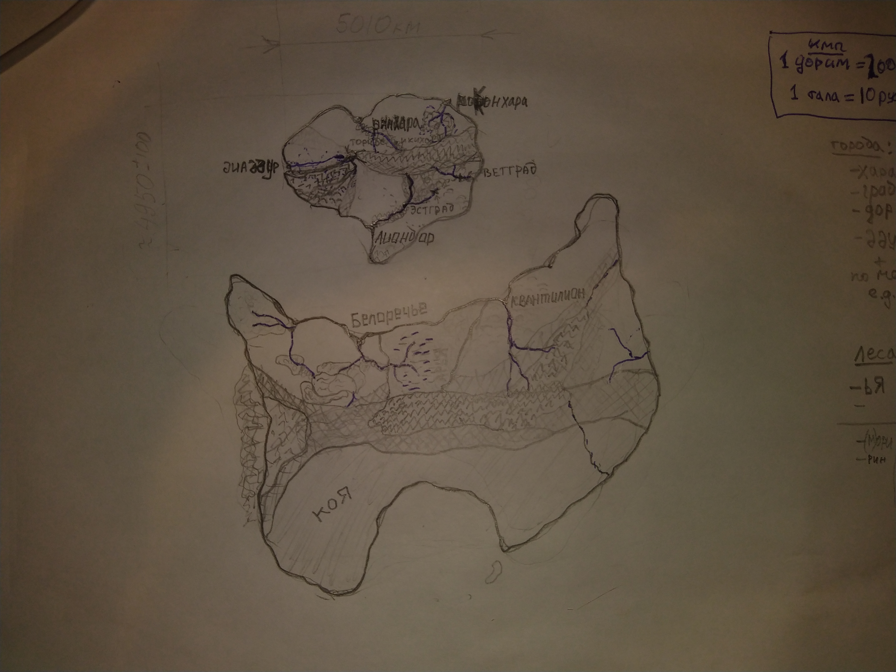

Теневая Канцелярия

Организация, управляющая Федерацией Соляриса. Сотрудники именуются агентами и делятся на две группы: агентов поддержки и агентов-оперативников. Последние, в свою очередь делятся по уровням допуска и правам (x уровень имеет права и обязанности x+1 уровня):

0 - имеют допуск ко всему и неограниченную власть составляют планы 0 уровня, выносят решение о принятии агента на службу

1 - имеют полный допуск к планам 0 уровня

2 - имеют полный допуск к планам 1 уровня, могут самостоятельно перемещаться между вселенными

3 - имеют полный допуск к планам 2 уровня, могут работать в группе под руководством старших агентов

4 (а.-наблюдатели) - имеют допуск к общим чертам плана 0 уровня по вселенной, в которой выполняют свою работу, обязаны периодически докладываться о её состоянии старшим агентам

ГСТК и ГлавСовГСТК - единственные агенты 0 уровня.

Федерация Соляриса

Государство, управляемое с Соляриса. Имеет жесткий тоталитарный режим (диктатуру ТК (диктатуру ГСТК)), включающий в себя свойства как утопии, так и антиутопии. Разумное население всегда удерживается в пределах 1,5±0.1 млрд, большая его часть антропоморфна, но есть и исключения, напр. драконы. Целевое соотношение численностей расчитывается из соотношения ср.продолжительности жизни того или иного вида и др.факторов. Существуют два диалекта общего языка, учитвающие возможности разных голосовых аппаратов.

Солярис

Живая землеподобная планета, являющаяся материальной базой (Теневой Канцелярии) Федерации Соляриса, которая взамен обеспечивает планете защиту. Участвует в поддержании порядка, предоставляя возможность незаметно следить за жителями. Позволяет ФС полностью контролировать свой климат. 
Её звёздная система единственная в её же вселенной. 

Арда

Зап.часть - Торикаи. (вост. часть Арды - Тоокаи, северная - Китакаи, Этен - Этенкаи)

Хранитель леса

По сути дриада с некоторыми особенностями.
Сильно зависит от своего леса, взрослеет вместе с ним. При помощи различных манипуляций со вселенной ХЛ можно модифицировать привязку ХЛ.
В любом лесу чувствует тех, кто в нём находится (в т.ч. других ХЛ). 
Если есть имя, то может произвольно изменять свою форму в пределах двух устойчивых состояний, но часто выбирает третью относительно стабильную форму, которая обычно сочетает плюсы и минусы первых двух в выгодной для ХЛ пропорции (по этой причине поначалу Ёрик несколько испугался Юмэ). Часто  Если нет имени, то может принимать форму любого лесного жителя. 

Нек. ХЛ:

 Арды: Арья (Этэнские болота), Юмэ (один из лесов рядом с Бааддуром)
 Соляриса: Юти(березовая роща и персиковый садик рядом с резиденцией ТК), Аки (там же, но более древний лес)

Энес 2

Император, который прекратил внутридинастическую войну между А. и Э., оставшись единственным наследником (отсылка к войне б и к роз в Англии[два лагеря перебили друг друга, а третий сказал "МОЁ!"])). Его именем названа ГМПС 2й Этэнской империи

Карта Арды:

